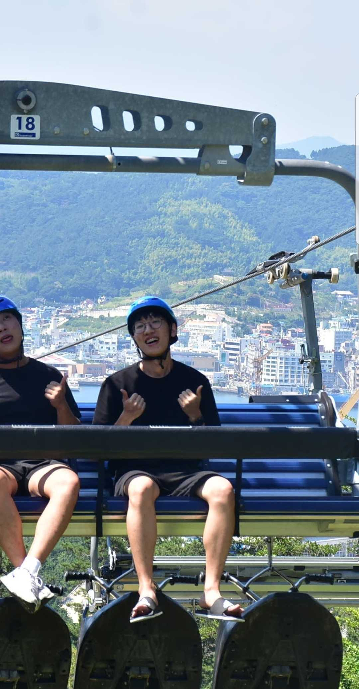
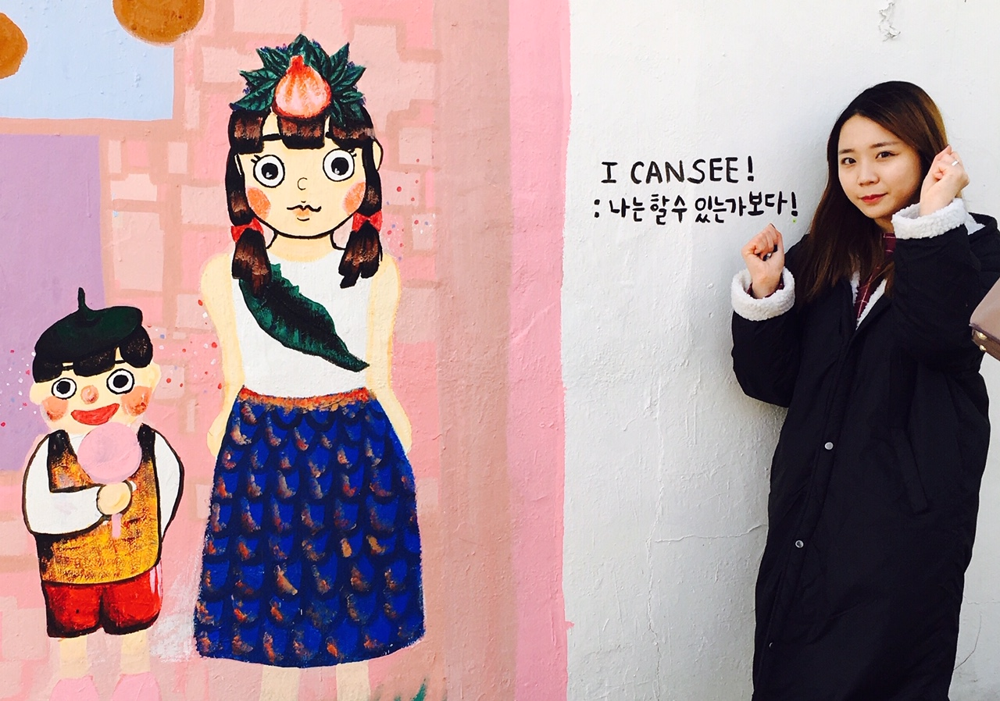
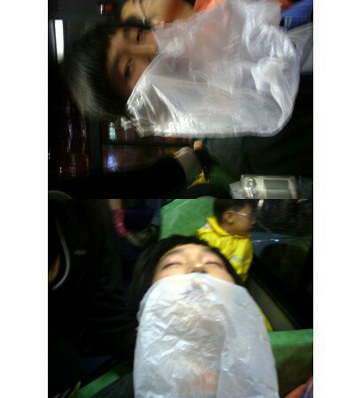
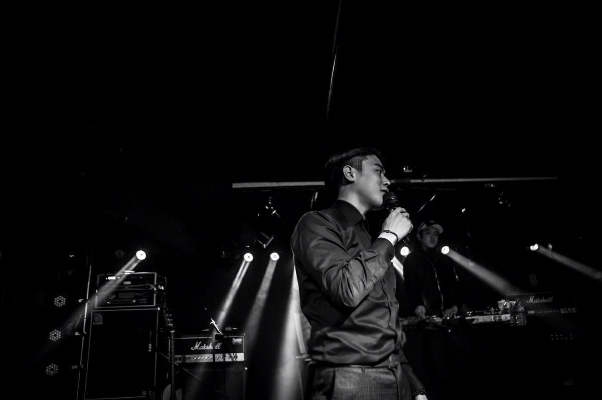

+++
@snap[center]

@snapend

+++

    

        
    

    

        <h3 style="font-weight:bold">김 현 욱</h3>
        <ul>
            <li>
            <h5>핫가이 + 유쾌함</h5>
            </li>
            <li>
            <h5>연말 계획 및 12월 31일</h5>
            </li>
            <h6> -> Java 공부해오기 + 밤새면서 새해맞기</h6>
        </ul>
    

+++

    

        
    

    

        <h3 style="font-weight:bold">전 민 용</h3>
        <ul>
            <li>
            <h5>미뇽 + 발랄함</h5>
            </li>
            <li>
            <h5>연말 계획 및 12월 31일</h5>
            </li>
            <h6> -> 친구들과 여행을 하며 올 한 해를 마무리하고 싶음 + ssafy 시작 전 마음 준비하기</h6>
        </ul>
    

+++

    

        
    

    

        <h3 style="font-weight:bold">지 창 규</h3>
        <ul>
            <li>
            <h5>지랄규 + 귀찮과 조용한 편</h5>
            </li>
            <li>
            <h5>연말 계획 및 12월 31일</h5>
            </li>
            <h6> -> 영어 원하는 점수 취득하기 + 독감으로 몸이 안좋아져서 쉬면서 컨디션 회복하기</h6>
        </ul>
    

+++

    

        
    

    

        <h3 style="font-weight:bold">임 현 아</h3>
        <ul>
            <li>
            <h5>혀나 + 시끄러움</h5>
            </li>
            <li>
            <h5>연말 계획 및 12월 31일</h5>
            </li>
            <h6> -> 가족들이랑 시간보내기 + 내년 계획짜기</h6>
        </ul>
    

+++

    

        
    

    

        <h3 style="font-weight:bold">조 원 철</h3>
        <ul>
            <li>
            <h5>대갈 + 밝음 긍정 생각없이 삶</h5>
            </li>
            <li>
            <h5>연말 계획 및 12월 31일</h5>
            </li>
            <h6> -> 친구들과 스키장 여행!!!</h6>
        </ul>
    

+++

    

        
    

    

        <h3 style="font-weight:bold">박 동 익</h3>
        <ul>
            <li>
            <h5>납득이 + 활발</h5>
            </li>
            <li>
            <h5>연말 계획 및 12월 31일</h5>
            </li>
            <h6> -> 친구들과 스키장 여행2!!!</h6>
        </ul>
    

