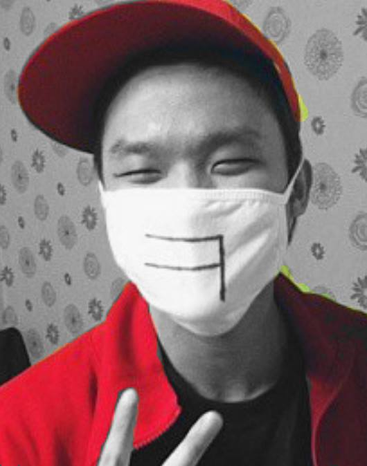

+++
@snap[center]

@snapend

+++?image=background.jpg

    

        
    

    

        <h3 style="font-weight:bold">김 현 욱</h3>
        <ul>
            <li>
            <h5>핫가이 + 유쾌함</h5>
            </li>
            <li>
            <h5>연말 계획 및 12월 31일</h5>
            </li>
            <h6> -> Java 공부해오기 + 밤새면서 새해맞기</h6>
        </ul>
    

