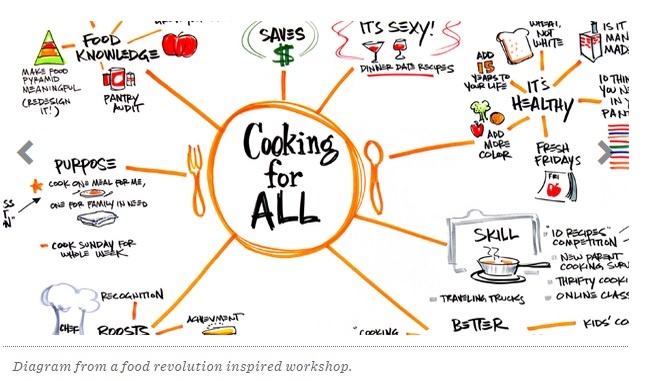

# 디자인싱킹(Design Thinking) 이란
"문제 해결에 있어서 디자이너들이 문제를 풀던 방식대로 사고하는 것"  
"공감하고, 문제를 정의하고, 이를 해결하기 위한 아이디어를 도출하고, 시제품을 제작하고, 사용자 테스트를 진행하는 단계"  

      
# 공감하기(EMPATHIZE)

관찰, 인터뷰, 직접체험 등을 통해 사용자의 경험을 이해해 보는 것  
고객이 진심으로 원하는것이 무엇인지 파악하고 문제를 발견하는 시작점

사용 툴  
* 공감지도:관찰을 위해 인터뷰하는 기법  
* 고객여정캔버스: 고객이 서비스와 처음 만나는 초기 접전에서부터 서비스가 끝나는 순간까지 서비스를 이용하는 과정을 시각화  
* 페르소나 만들기: 특정 사용자 그룹을 대표하는 가상 인물을 설정하여 구체적이고 명확한 대상 정하기  

# 정의하기(DEFINE)

고객의 입장과 시선으로 문제를 정의하기

사용 툴  
* 관점 서술문 : 사용자 관점에서 문제점을 명확하게 인식 할 수 있다.  

# 아이디어 내기(IDEATE)

아이디어를 자유롭게 발산하는 단계 

사용 툴  
* 마인드맵 : 문제해결을 위한 변수를 고려한 아이디어를 도출 할 수 있다.
* 브레인 라이팅 : 도출된 대표 아이디어를 발전 시킬 수 있어 구체적으로 정의 한다. 

# 시제품 만들기(PROTOTYPE)
 
시제품 : 성능검증 및 개선을 위하여 상품화에 앞서 제작  
아이디어를 시제품으로 만들어 보고 사용해보기  
시제품은 최대한 간단하고 빠르게 만들어 사용시의 느낌을 경험할 수 있도록 함  
  
사용 툴  
* 카카오 오븐 : HTML5 기반의 웹/앱 프로토타이핑 툴

# 테스트 하기(TEST)
 
프로토타입에 대한 피드백을 받음  
이때 사용자에 대해 연구하고, 정말 문제가 무엇인지 다시 생각해 봄  

사용 툴  
* 피드백: 피드백을 통한 수정, 보완
